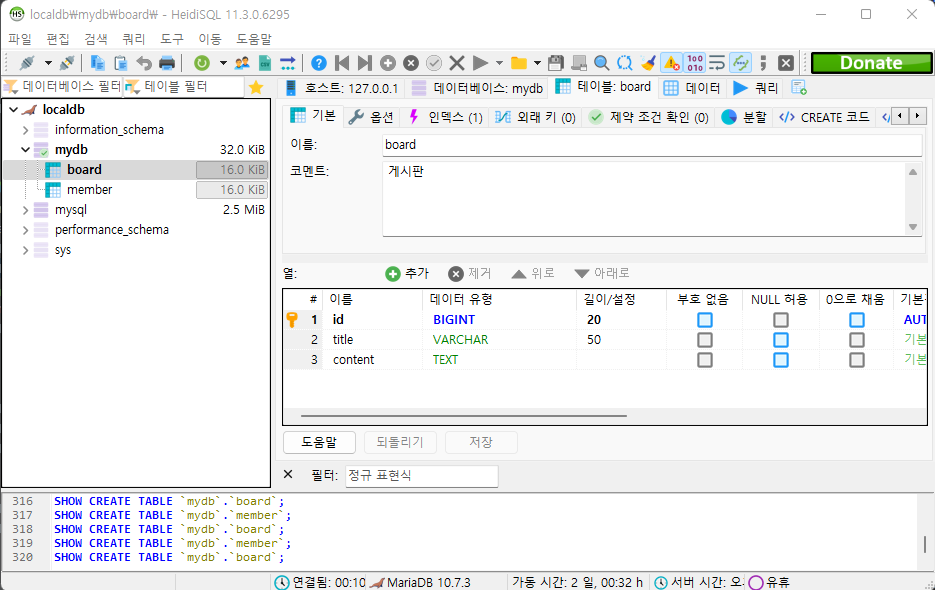

<h2>기본 서식</h2>

    1. *    //object의 속성값을 나타낼 수 있다.
    2. #    //다국어 설정을 해 사용한다.(번역)
    3. $    //변수를 사용할 때 사용한다.
    4. ~    //템플릿을 교체, 삽입 할때 사용한다.
    5. @    //url링크에 변수를 이용할 때 사용한다.

1. href="www.naver.com"

2. th:href="@{/css/gtvg.css}"

front로 구동하면 1번이 back으로 구동하면 2번이 실행된다.

text 텍스트만 출력이 가능하다.

utext 태그까지 출력이 가능하다

<h2>스탠다드 출력</h2>

표현식 기본 개체 컨텍스트 변수에 대한 OGNL 식을 평가할 때, 일부 개체는 보다 높은 유연성을 위해 식에 사용할 수 있도록 한다.이러한 객체는 (OGNL 표준에 따라) 에서 시작하여#기호:

    ctx: 컨텍스트 객체.
    vars:문맥 변수
    locale: 컨텍스트 로케일.
    request: (웹 컨텍스트에서만)HttpServletRequest이의를 제기하다
    response: (웹 컨텍스트에서만)HttpServletResponse이의를 제기하다
    session: (웹 컨텍스트에서만)HttpSession이의를 제기하다
    servletContext: (웹 컨텍스트에서만)ServletContext이의를 제기하다

<h1>마리아 DB연결 및 폼 생성</h1>

1. marven mariadb 여기서 implements 코드 가져온다.

https://mvnrepository.com/artifact/org.mariadb.jdbc/mariadb-java-client

2. marven jpa 여기서도 implements 코드 가져온다.

implementation 'org.springframework.boot:spring-boot-starter-data-jpa'

3. mariadb spring boot 를 검색해서 properties 설정을 한다.

   spring.datasource.driverClassName=org.mariadb.jdbc.Driver spring.datasource.url=jdbc:mariadb://127.0.0.1:3307/mydb
   spring.datasource.username=woojin spring.datasource.password=1234

   // spring.jpa.hibernate.ddl-auto=create-drop 실행될때마다 테이블이 생성되고 종료되면 테이블이 삭제된다.

4. heidisql을 열어 사용할 스키마를 생성하고 저장할 형식의 테이블을 생성한다.

5. index설정으로 primary key를 설정한다음 auto_increment로 설정한다.

6. 데이터베이스로 집어 넣을 스프링 폼도 db의 형식에 맞게 설정해 준다.

7. @Id @GeneratedValue(strategy = GenerationType.IDENTITY) primary key로 자동으로 증가한다.

타임리프

타임리프를 이용한 onclick 사용

    <tr th:each="post : ${posts}"
        th:onclick="|location.href='@{/post_list/post_detail(id=${post.getId()})}'|"
        style="cursor:pointer;">
        <td th:text="${post.getId()}"></td>
        <td th:text="${post.getTitle()}"></td>
    </tr>

||를 사용하여 범위 안에 있는 문자열들을 연결해주는 역할을 한다.

onclick메소드는 신호가 들어왔을때 실행한다.

style="cursor:pointer;" 는 <th>태그에 커서가 올라오면 클릭할 수 있는 모션으로 마우스가 변경된다.

